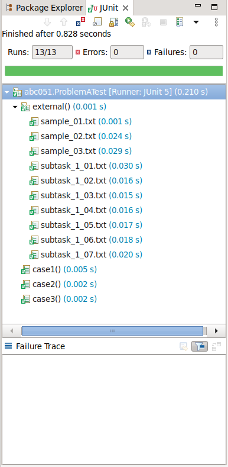

# atcoder.java.template
Template of Atcoder Java Answers

## 外部テストケースの使い方
1. src/test/resources/external.properties.sample をコピーし、src/test/resources/external.properties ファイルを作成する

1. src/test/resources/external.properties を以下のように編集する
```
# 外部フォルダーを使用するかどうか
USE_EXTERNAL=true
# 外部フォルダーを指定する
EXTERNAL_FOLDER=外部フォルダーのパス
```

1. [Atcoderのテストケース](https://www.dropbox.com/sh/nx3tnilzqz7df8a/AAAYlTq2tiEHl5hsESw6-yfLa?dl=0) からテストケースをzip形式でダウンロードし、外部フォルダーに配置する。
例えば、ABC051のテストケースはABC051.zipとして、ダウンロードされる。
1. 該当のテストファイルに以下のようなコードを追加する。
```
	@TestFactory
	Collection<DynamicTest> external() {
		return checkExternal("ABC051/A");
	}
```
ここでの`ABC051/A`の最後の`A`はA問題を意味する。

1. 該当のテストクラスをJUnitで実行する。
Eclipseでは以下の画像のようになれば、設定が正しいことが確認できる。  


## テスト時実行時間チェックの使い方
1. src/test/resources/timeLimit.properties.sample をコピーし、src/test/resources/timeLimit.properties ファイルを作成する。
1. src/test/resources/timeLimit.properties に以下の値が設定されていることを確認する。
```
# 実行時間制限チェックを実施するかどうか
CHECK_TIME_LIMIT=true
```
3. src/test/resources/timeLimit.properties に以下のフォーマットで制限時間を指定する。
```
テストクラスのパッケージも含めたクラス名=制限時間(ミリ秒)
```
例えば、
```
abc.abc001_050.abc005.ProblemDTest=5000
```
ただし、指定しない場合では、制限時間のデフォルト値が2000msである。

4. 該当のテストクラスのJUnitテストを実行する。
実行時間が制限時間を超えた場合、以下のようにコンソールに表示される。  

